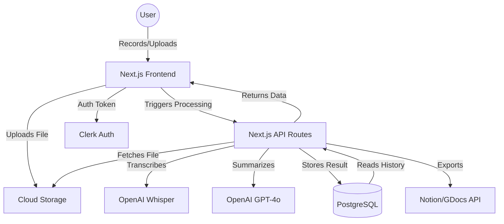

# System Architecture - AI-Note-Taker

This document outlines the architectural decisions and system design for the AI-Note-Taker application.

## Overview

The system is designed to handle audio data processing through a pipeline: Audio Capture -> Storage -> Transcription -> Summarization -> Presentation.

## Component Diagram

## Database Schema

### `User`
- `id`: UUID (Primary Key)
- `externalId`: String (Clerk ID)
- `email`: String
- `name`: String
- `createdAt`: DateTime

### `Meeting`
- `id`: UUID (Primary Key)
- `userId`: UUID (Foreign Key to User)
- `title`: String
- `date`: DateTime
- `duration`: Float (seconds)
- `audioUrl`: String (Cloud storage link)
- `status`: Enum (UPLOADING, PROCESSING, COMPLETED, FAILED)
- `transcript`: Text
- `summary`: Text
- `tldr`: Text
- `createdAt`: DateTime

### `ActionItem`
- `id`: UUID (Primary Key)
- `meetingId`: UUID (Foreign Key to Meeting)
- `content`: Text
- `completed`: Boolean
- `createdAt`: DateTime

## Data Flow

1. **Authentication**: Users authenticate via Clerk. The `userId` is used to associate all data.
2. **Audio Upload**:
   - Client-side: Audio is recorded or selected.
   - The file is uploaded directly to Cloud Storage (S3/Supabase) via a signed URL to minimize server load.
3. **Processing Pipeline**:
   - Once uploaded, the client calls `POST /api/meetings/process`.
   - The server sends the audio URL to OpenAI Whisper for transcription.
   - The resulting transcript is sent to GPT-4o with a specialized prompt for TLDR, summary, and action items.
   - All results are saved to the PostgreSQL database.
4. **Polling/Updates**: The client polls for the `status` of the meeting or uses a webhook/Websocket to receive an update when processing is done.
5. **Retrieval**: Users can view their meeting history and drill down into specific transcripts and summaries.

## Export Integration

The system uses OAuth for third-party integrations (Notion, Google Docs).
- **Notion**: Uses the Notion API to create a new page in a selected database or workspace.
- **Google Docs**: Uses the Google Drive/Docs API to create a document with formatted content.

## Scalability Considerations

- **Serverless Execution**: Next.js API routes handle concurrent requests.
- **Background Jobs**: For long-duration audio, processing should be moved to a background worker (e.g., Inngest or Upstash QStash) to avoid timeout issues in serverless environments.
- **Storage**: Cloud storage handles large audio files efficiently.
